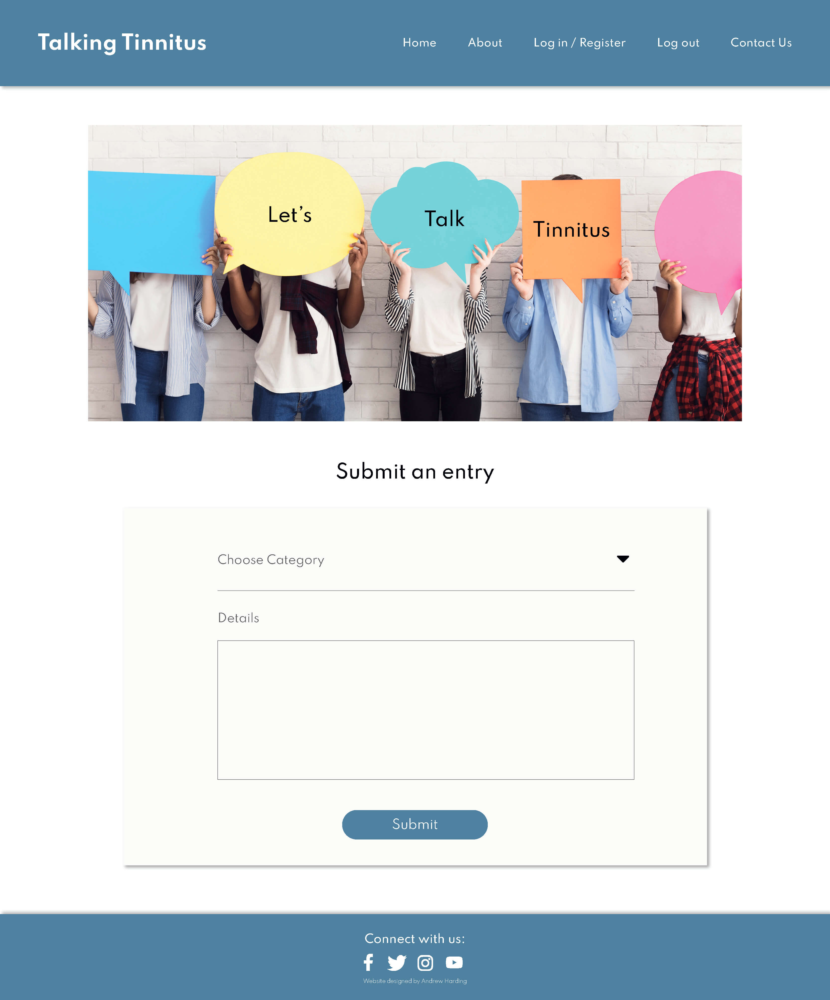

# Talking Tinnitus

The website / service that I have designed is to help people like myself to be able to as the title says Talk Tinnitus and all things tinnitus related. This site has been created as I know what it is like for people with tinnitus, their thoughts and feelings towards this. I understand as someone who has tinnitus and as a Volunteer Befriender for the British Tinnitus Association, (who regularly makes calls to people who have tinnitus) just how it affects different people in different ways. I also understand from doing my own research regarding tinnitus as well as web training to help better understand and assist further. Having gone down the route of GP and then Hospital appointments like so many others with tinnitus, I know that there is more to be done in terms of research. So unfortunately it is all about managing this noise that only you can hear until there is some sort of cure. Also I have seen and read that people do take their own lives because of tinnitus and this is why I believe that if people talk about tinnitus and have another resource, others to connect to etc that we can make a positive change, people can manage it for now and keep the faith that everything is fine and that they are not alone on their tinnitus journey.

Having been and spoken to the British Tinnitus Association and as a volunteer for them myself, they have said that I have many good tips and tricks, am knowledgable about this and manage my tinnitus quite well. It is with any hope that this website / service if it were to be plugged into a domain (such as https//:www.talking_tinnitus.com) and with a real push of social media that this could be another vital asset for those who also experience tinnitus. 

## Showcase:

A deployed live version of my Talking Tinnitus website / service can be found [here](https://talking-tinnitus.herokuapp.com/)

This domain link will allow you to access my live deployed Talking Tinnitus website / service as part of the Code Institute Full Stack Web Developer Milestone 3 Project assessment.
My website / service has been designed to be responsive across all devices and layouts, whilst also being simple, clean and easy to navigate for the users and community that it exists to serve.

## Table of Contents
1. [User Experience UX](#user-experience-ux)
    * [User Stories](#user-stories)
    * [As a new / first time user](#new-first-time-user)
    * [Returning Visitor Goals](#returning-visitor-goals)
    * [Frequent User Goals](#frequent-user-goals)
    * [User Customer Goals](#user-goals)
    * [Business Goals](#business-goals)
2. [Construction Planes](#construction-planes)
    * [Strategy](#strategy)
    * [Scope](#scope)
    * [Structure](#structure)
    * [Skeleton](#skeleton)
    * [Surface](#surface)
3. [Design](#design)
    * [Imagery](#imagery)
    * [Wireframes](#wireframes)
    * [Entity-relationship-planner](#entity-relationship-planner)
4. [Features](#features)
    * [Existing-features](#existing-features)
    * [Future-features](#future-features)
5. [Technologies and Languages Used](#technologies)
    * [Libraries Frameworks and Online Resources Used](#libraries)
    * [Tools](#tools)
    * [Programmes](#programmes)
    * [Other Resources](#other-resources)
    * [Social Media](#social-media)
6. [Testing](#testing)
    * [Implementation](#implementation)
    * [Results](#results)
    * [Bugs](#bugs)
7. [Deployment](#deployment)
8. [Credits](#credits)
    * [Content](#content)
    * [Media](#media)
    * [Acknowledgments](#acknowledgments)

## User Experience UX:
My website / service has been designed by myself Andrew Harding because as mentioned above I have tinnitus and help / support others that have tinnitus too through the voluntary work that I do for the British Tinnitus Association. I have designed this website / service with others in mind based on my own knowledge, talking to and reading about others who also have tinnitus, how they perceive their tinnitus, how they manage it and the problems someone new to tinnitus or someone who has noticed a change in their tinnitus faces. Also the lack of knowledge of some GPs and Hospitals about tinnitus can leave a patient with this (having been told “there is nothing (more) we can do for you”) feel and the thoughts about their tinnitus as well.

I hope that as outlined above that users who will use my website / service will be able to see that there is hope, although not a cure, there is hope. It can and does get better when you control your tinnitus, the thoughts and feelings towards it and how you come to live alongside it which is what they call habituation. Also by Talking Tinnitus with others who have and experience tinnitus this could help others in reaching out, finding help, helping others and forming new friendships. My website / service is very clever as it allows the user to take control by Creating content, Reading others content, Updating content as well as Deleting content that they may have posted, this in turn it is hoped will allow the user to see the way they manage their profile and posts as a way to manage and take control of their tinnitus, although unfortunately not delete it, but delete the negative impact that it has or has had on their lives.

## User stories:
* I would like my new / first time users to be able to complete their goals when visiting my website / service. I would expect that not only people with tinnitus to use my website / service but also others who may know someone who has and is also experiencing tinnitus to use this website / service.
* I would like users who don’t have tinnitus to gain an understanding and be able to emphasise with those that have and experience tinnitus by reading the Home What is tinnitus section as well as the All Entries posts and actively engage further to see how they will be able to help, support and understand someone who has tinnitus.
* I would like my users who have tinnitus to be able to help themselves by reading the posts that others have added in the All Entries section.
* I would like my users who have tinnitus to be able to help others by adding their helpful comments and suggestions to the different categories for example Helpful Products, with the reason(s) they would recommend this and how they believe it can and will help others.
* As a new / first time / user I would like them to feel they are able to engage by registering, logging in and contributing (rather than feeling like they have been forced to do this), as well as returning to continue add to the database collection of entries.
* As a new / first time / returning user I would like the users to get a feel and sense of a community type of group, where we are here to help each other and that is our main goal here.
* As a user I would like them to get in contact through the contact us page to request new categories for my website / group, so they are able to contribute further.
* As a user I would like them to know that we are there for them, but are not medically trained to be able to provide a diagnosis, more so a listening ear and a helpful community of users to help each other and make this experience with tinnitus a bit more of a positive thing rather than fully negative regarding thoughts / feelings, although this is fully understandable to start with.
* As a user I would like them to experience their growth through time on this site, from not being able to manage, to being able to live alongside tinnitus and manage / control it, instead of it controlling them and how they feel etc.

#### As a first time user I would expect the questions asked would be:
* How is this of benefit to me and what does this have to offer me?
* Does this site / service achieve my aim of what I am looking for?
* Is the content relevant and helpful to me?
* Why should I use this website / service? 
* What does it have to offer me?
* Does this website / service give me the information that I require?
* Am I able to get any products that others with tinnitus have tried that they would recommend to others and their reasons for this?
* Can I find support groups with an insight to what they do and how they help?
* Am I able to contribute to this website / service?
* Do I need to Register for an account to this service?
* Is the login process once registered easy to do and am I able to contribute and post content easily?
* If there is a way that I can contribute to the site / service how would I go about doing this?
* If there is a way that I can contribute to the site / service what categories are there that I would be able to contribute to?
* With the categories are these limited or am I able to add / request new ones?
* Am I able to get an insight from others about their experience of tinnitus?
* Am I able to get an insight from others about how they manage their tinnitus?
* Am I able to get an insight from others about what they recommend product wise that helps them with their tinnitus, where they would recommend purchasing from and the price for this?
* Am I able to get an insight from others about any specific recommendations that helps them like an app with the price for this, why this helps etc?
* Am I able to get an insight from others about any specific recommendations that helps them like exercises and how these are beneficial and help them, also in doing so the best place to go for this?
* Is there a section where I can add my thoughts and feelings towards tinnitus so that people can see how it does get better over time?
* Am I able to search for any information on a specific subject if the site is allowed to have user input / contribution?
* Am I able to connect to other users further maybe using something like social media?

#### For someone who doesn’t have tinnitus I would expect them to ask the following questions: 
* Does this website / service give me an idea and understanding of what tinnitus is?
* Does this website / service give me an insight to how people with tinnitus feel?
* Does this website / service give me an understanding of how people experience their tinnitus?
* Does this website / service give me ideas and information that I could use to help someone with tinnitus?
* Does this website / service have the ability to be able to find out more about tinnitus from external sites in order to get further support for someone who has tinnitus?
* Does this website / service enable me as someone who doesn’t have tinnitus to be able to contribute to find out how others who know someone with tinnitus and how they help them?

#### Returning Visitor Goals:
* As a returning user / visitor I would expect to be able to register for an account (if they haven’t done so already) and log in easily.
* One having registered or logged in I would like to be able to post information that will be of help to someone in the different categories.
* I would like to be able to get in touch and suggest categories.
* I would like to be able to continue to contribute to the current categories and more categories as these are added.
* I would like to be able to update any information as and when this changes, or if necessary delete this information.
* I would like to be able to use the site logging in and contributing as easily as I currently do now.
* I would like to be able to still search for the information out of the categories that I am looking for.

#### As a returning user I would expect the questions asked would be:
* Is the register / log in process as easily accessible as before when I first visited?
* Is there anything I would be able to offer to this site / service?
* Is there anything I can learn / take away from this site / service?
* Is the information in the categories being updated by the site / service owner / other users?
* Am I benefiting from the interaction from this site / service and the content posted by other users / site owner?
* Has there been new categories added as per the request that I or other users have sent via the contact us form?
* Is the site / service being updated often enough to keep me returning and learning?
* Am I able to achieve my goals and needs from this site / service?
* Am I able to continue my learning from this site / service?

#### Frequent User Goals:
* I would like to see the users frequent my site / service and interact with this by adding information into the categories provided, as well as requesting categories that I haven’t added yet.
* I would like users to benefit from my site / service and recommend this to others to join and also contribute to this.
* To feel like a valued and active member of this site / service by contributing as often as possible.

#### As a frequent user I would expect the questions asked would be:
* Will there be any other categories that I am will be able to add an entry to?
* What is the timescale from getting in touch with the site owner about something like adding a new entry category before this is active so that I am able to add my contribution to?
* Are the entries that users are adding of value to me and am I able to show appreciation for this users' entry by adding a comment or like?
* Is the content in terms of the pages that users cannot add to being updated with new content?

I would expect the bulk of my frequent users to have tinnitus and be contributing to my site / service on a regular basis. This being said I would expect these users to be benefiting from my site / service as well as be a key part of my site / service that is being offered to them.

#### User Goals:
The user goals that I would like Talking Tinnitus to provide to the users are as follows:
* I would like users to be able to navigate around my site / service pages quickly and efficiently thus enabling them to find the information that they are looking for with minimal effort. This will create a great user experience and keep users returning and contributing to the growth of my site / service.
* I would like users to be able fo find the information in the search box on the All entries to their questions, but if these answer hasn’t been posted to be able to get in touch using the contact page provided.
* With the Social media icons there it is hoped that users will also actively engage with the various channels, pages, groups etc that have been set up for this project by following, liking and also commenting on these too. But whilst they are there for users to engage in it is hoped that they will engage more in my site/service more than social media, although with social media this can be used to promote my site / service and any updates that occur on this, as well as any interesting articles for users to view/follow.
* I would like the users to feel comfortable in contributing to my site / service and feel that this is a simple and easy to use process.
* I would like users who maybe doing research to also be able to contribute as well as those with tinnitus, GP’s and other health professionals too. I would like the users to show the researchers, GP’s and other health professionals what tinnitus is like as well as the health professionals, researchers, GP’s to be able to offer their help and advice too. This can be done by adding to any of the current categories as well as suggesting new categories too.

#### Site Goals:
* As mentioned before I would also like the users to include people who don’t have tinnitus to play an active part on my site / service. This is so that they are able to understand what their friend, partner etc are going through with tinnitus, but also learn from others too. This could help them in their understanding and support for this person.
* I would also like people like GP’s and health professionals to be able to join in using my site / service so that this also helps them to help their patients further as they have a better understanding from looking at it from the patient perspective.
* I would like users to feel a sense of community when using my site / service and feel happy to use my site / service helping themselves and others who will use my site / service.
* I would like users to be able to recommend others to my site / service mentioning how this benefits and helps them, this will make the community grow and the help to themselves and others also grow having a greater reach and impact as this continues to the users. This will achieve how we can help you and how you can help yourself part of the “contract” so to say.
* It would be absolutely amazing if charities and organisations such as the British Tinnitus Association were to recommend my site / service to their users as another way to help them. Almost like a virtual community support group. Once finished I will be speaking to the British Tinnitus Association to see what they think and whether or not this is something that can also help them with their mission.

## Construction Planes:
#### Strategy:
My original name for my website / service was going to be Training Tinnitus, but I thought that this was not a suitable title. I then thought that Talking Tinnitus would be a better name and approach to take as this would help people to instantly connect and understand exactly what the site has to offer as well as what it does and what it allows the user to do. Which simply put is to talk about all things tinnitus related. With the change in name this gave me areas that I would be able to focus on in order to develop the content for my website / service. Also this allowed me to focus in on the categories that I would add for the user to go on and add their content too. This gives me a clear and precise layout and helps with the goals for creating my website / service and refines this also to make it more easily manageable.

#### Scope:
Again I have opted to keep the layout as simple as possible in order to speed up development time and give the user the information they are looking for in a clearly laid out way, making this easier for them to see what my site is all about, how they can be a part of my site and what it has to offer them. I will have a couple of templates based on the design that I have done, this will then also enable me to be able to speed up the development as well as create a website / service that is appealing and functionally useful to the user.

I hope that having a clean layout with the information that I have written and imagery chosen this will guide the user to the main part where they get stuck in, interact with the site by adding, reading, deleting and updating the content they have written, as well as what others have written, and therefore being part of my website / service have will have value from the service that it offers to them as a user.

#### Structure:
The structure of my website / service enables users to quickly navigate to their chosen page, it allows them to log in or sign up effortlessly, return, contribute and be a valued member of my website / service. All information has be presented in a clean easy to read and understand manner and layout making my website / service fully user-friendly throughout. I will have also included full accessibility by having the alt text for any images to help with any visual impairments a user may have. All registered users will be able to upon registering log in and take full control over their profile and their content whilst also adding value to my site for the benefit of other users. Unlike my previous sites Go Tennis System and War Heroes Remembered I have taken the About Us and have placed this on its own page. This is so that I can add more information and hopefully on a desktop (and in portrait mode on something like an iPad) have less scrolling for the user.

#### Skeleton:
All information will be grouped under relevant headings and laid out cleanly and clearly on the page as per the structure section, this will enable users to quickly find what they are looking for and navigate my website / service efficiently. I will be adding images that relate to the site theme of tinnitus as well as images that relate to pages such as how can we help you? and how can you help you? Across all pages there will be the nav bar and the footer to help users navigate to the pages or even to the various social media channels, groups, pages, accounts that I have set up for this project. With the social media links these will be represented as always using the various font awesome icons / logos for each of the social media pages.

#### Surface:
My finished website / service will have a clean look and feel as well as an organised and well-structured layout too. This will help the user to get the most from my website / service and keep them on my page for longer, as well as get them to interact with my website / service. With a clean and professional look and feel this will give the users the information quickly and precisely that they are looking for. I have chosen a font from [Google Fonts](https://fonts.google.com/specimen/Spartan?query=spart) called Spartan, This font is clean and helps with the professional look and feel that I am looking to show to the user. I have used a nice teal type colour for the nav bar and footer as it matches the main hero image on the home / index page. Also this is an appealing and in a way calming colour to use and helps stand out on the white space and clean design around the nav bar and footer.

## Design:
For the design of my website / service I have used two basic information pages, home (index) and the about us page. These pages give the user the information about my website / service that they are viewing as well as the goals for them and my website / service that they are being provided. I have added a contact us page to allow users to get in touch and interact further should they wish to do so. Also incorporated are the following pages: manage category, all content, add content, edit submitted content, login and register pages. 

* The Manage Category page will be admin only. This will allow an admin to add, edit and delete categories as the need arises. 

* The Entries page will display to the user all the submitted content by all users. Here is where the user will be able to read others content, as well as edit and delete their own content.

* The Login and Register pages will allow users to sign up, or if they are already signed up log into their account. Once registered or signed in the user will be able to head over to the main content page and post their thoughts.

In my live site design that I produced in [Adobe InDesign](https://www.adobe.com/uk/products/indesign.html) giving a more finished look and feel to the site I have included the colour breakdowns for teal type colour used in the nav bar and the orange that has been used for the section headings and bullet points that are on the home page.as mentioned above the main teal type colour was chosen as it matched the home / index hero image, there is also black used in the hero image and so the text has been left as default black, whilst the headers for the different sections on the home and about page as well as the bullet points have been given an orange colour to liven the page up a bit more and introduce a secondary colour. Other colours include a pale mint colour for the hover of the Social Media links as well as a dark red and blue for the delete and edit buttons on the Manage Categories and the Entries pages.

The images have been chosen to fit in with my website / service and to accompany the various text themes that they sit near. This is to break up the text and give some visual impact to entice the viewer to want to read the content.

The original mock designs that I produced in Adobe InDesign can be found below:

#### Home / index page

#### Home / index mobile layout

#### About Us

#### About Us mobile layout

#### Log in
 Ideal design for this page.
#### Log in mobile layout

#### Register
 Ideal design for this page.

#### Register mobile layout

#### My Profile

#### My Profile mobile layout

#### Submit Entry
 Ideal design for this page.

#### Submit Entry mobile layout

#### All Entries

#### All Entries mobile layout

#### Contact Us

#### Contact Us mobile layout

#### Manage Categories - ADMIN ONLY

#### Manage Categories - ADMIN ONLY mobile layout

#### Add Category - ADMIN ONLY 

#### Add Category - ADMIN ONLY mobile layout

#### My Design instructions

#### Links for entries

#### Code instruction

## Imagery:
The images that I have used have been sourced and purchased from [Adobe Stock](https://stock.adobe.com/uk/).

##### Home Page:
[Good hearing, soundwaves, medical artwork](https://stock.adobe.com/uk/images/good-hearing-soundwaves-medical-artwork/137447095)
By Axel Kock
File Number: 137447095

[Tinnitus einer Frau, 3D Illustration](https://stock.adobe.com/uk/images/tinnitus-einer-frau-3d-illustration/85261887)
By Axel Kock
File Number: 85261887

[Group of people practicing yoga in park](https://stock.adobe.com/uk/images/group-of-people-practicing-yoga-in-park/213654633)
By Prostock-studio
File Number: 213654633

##### About Us:
[Senior wearing hearing aid in her ears in front a laptop](https://stock.adobe.com/uk/images/senior-wearing-hearing-aid-in-her-ears-in-front-a-laptop/138129727)
By Goodpics
File Number: 138129727

[People communicating with each other sitting in circle in group therapy session. Black woman comforts, supports and reassures upset unhappy caucasian mature man. You're not alone. We're here for you](https://stock.adobe.com/uk/images/people-communicating-with-each-other-sitting-in-circle-in-group-therapy-session-black-woman-comforts-supports-and-reassures-upset-unhappy-caucasian-mature-man-you-re-not-alone-we-re-here-for-you/458056982)
By Studio Romantic
File Number: 458056982

[Delighted positive woman looking at you](https://stock.adobe.com/uk/images/delighted-positive-woman-looking-at-you/170686047)
By zinkevych
File Number: 170686047

##### Profile:
[World hello day banner with bubbles with word Hello in different languages - English, Russian, Spanish, Italian, French, Turkish, Sweden](https://stock.adobe.com/uk/images/world-hello-day-banner-with-bubbles-with-word-hello-in-different-languages-english-russian-spanish-italian-french-turkish-sweden/465577580)
By Mariia
File Number: 465577580

##### Register / Sign Up:
[woman using laptop, searching web, browsing information, having workplace at home / soft focus picture / Vintage concept](https://stock.adobe.com/uk/images/woman-using-laptop-searching-web-browsing-information-having-workplace-at-home-soft-focus-picture-vintage-concept/184972433)
By Urupong
File Number: 184972433

##### Login:
[Models On screen, illustration of an otitis](https://stock.adobe.com/uk/images/models-on-screen-illustration-of-an-otitis/158907990)
By RFBSIP
File Number: 158907990

##### Add Entry:
[Teenagers holding speech bubbles with copy space](https://stock.adobe.com/uk/images/teenagers-holding-speech-bubbles-with-copy-space/252949825)
By Prostock-studio
File Number: 252949825 

##### Contact Us:
[Contact us or Customer support hotline people connect. Businessman using a mobile phone](https://stock.adobe.com/uk/images/contact-us-or-customer-support-hotline-people-connect-businessman-using-a-mobile-phone/360197061)
By RoBird
File Number: 360197061

##### Favicon:
[Speech bubble / speech balloon or chat bubble line art icon for apps and websites](https://stock.adobe.com/uk/images/speech-bubble-speech-balloon-or-chat-bubble-line-art-icon-for-apps-and-websites/203635604)
By martialred
File Number: 203635604

As this file is was created by martialred using Adobe Illustrator, I was able to make some changes to in order to custom this slightly so that it would look how I would like it to look and fit in with the colour and feel of my website / service.

##### Font Awesome Icons:
* [Facebook icon](https://fontawesome.com/v5.15/icons/facebook-f?style=brands)
* [Twitter icon](https://fontawesome.com/v5.15/icons/twitter?style=brands)
* [Instagram icon](https://fontawesome.com/v5.15/icons/instagram?style=brands)
* [YouTube icon](https://fontawesome.com/v5.15/icons/youtube?style=brands)
* [Send icon](https://fontawesome.com/v5.15/icons/paper-plane?style=regular)
* [Add Category - Category Name](https://fontawesome.com/v5.15/icons/folder-open?style=regular)
* [Add Category Button](https://fontawesome.com/v5.15/icons/plus?style=solid)
* [New Category](https://fontawesome.com/v5.15/icons/folder-plus?style=solid)
* [Search Entry](https://fontawesome.com/v5.15/icons/search?style=solid)

## Wireframes:
The wireframes that I have produced for my Talking Tinnitus website / service can be found located [here](assets/designs/wireframes). A lot like my previous sites I wanted to keep the various pages clean, simple and attractive so that they relay the information easily and effectively to the user. This will help with the visual appeal as well as keep the user interested, read the content and less likely to leave the site (creating a high bounce rate).

All wireframes were created using [Balsamiq](https://balsamiq.com/). I produced a finalised version of the wireframes using [Adobe InDesign](https://www.adobe.com/uk/products/indesign.html). This is so that I can see a better outcome of my site / service when this has been completed, as well as bit more of a good guide of what I would like to see when I’m checking to make sure everything looks similar to how I would like it to.

#### Home / Index page

#### About Us

#### Register

#### Log in

#### My Profile

#### All Entries

#### Submit an Entry

#### Contact Us

#### Manage Categories - ADMIN ONLY

#### Add Category - ADMIN ONLY

### Entity Relationship Planner:
The mapping and planning out for my database was constructed using [dbdiagram.io](https://dbdiagram.io) and can be viewed below from the screenshot that I have taken and loaded into my README. This shows how the database is managed and constructed as well as contributed to by both users and admin.

#### Database Planner with code

#### Database Planner

# Features:
In this section I will briefly highlight some of the many existing features that that my site / service has to offer the user(s) that will use visit and use my site / service. I have also listed what I believe the benefit to the user that these features have.

* My site / service enables the user to be use this on different devices such as computers, tablets and phones as this is fully responsive to fit and work on all of these. This enables the user to be able to use my site / service wherever they are, whenever they like.
* The home and about have a similar layout to keep with consistency. There is also the hero image that has been added to each of the user pages to keep consistency as well as to make the page slightly attractive than just a form, or lots of text there. The only exceptions to this are the All Entries, the Add Category and Manage Category pages. The Add Category and Manage Categories pages I feel do not require a hero image as this is an admin only page, and therefore as it isn’t shown to the user would serve very little practical purpose in having an image. Although there is nothing to stop this later being added should I so wish to do so. The all entries page doesn’t have a hero image as I would like the user to focus mainly on reading the entries as well as adding, editing or even deleting their own entry or entries as they see fit.
* The content has been laid out on different pages so that users are able to easily understand what they are expected to do when they are on said page. This also helps with the clean look and feel that I want to display to the user / users.

* The Talking Tinnitus brand name in the nav bar has been enabled so that the user can click this in order to go to the home / index page of my site / service, giving the user(s) a positive user experience.

* The nav bar is able to collapse thanks to the help of Materialize and Font Awesome for the bars / hamburger icon. When clicked this will extend from the right-hand side of the screen and allow the user to use the menu effectively and navigate my site / service easily.

* There is a contact form that has been linked again to EmailJS so that emails come through from my site / service to my Gmail email address, which will enable me to answer any enquiries and messages effectively, resulting in another positive user experience.

* Again like my previous Milestone Projects I have the Font Awesome social media icons that have been linked to the social media channels that I have set up specifically for my website / service. This is to give the whole thing a professional finished feel when these are clicked on. Users are able to like, comment, upload to the different social media channels that I have used, again helping with a positive interactive user experience.

##### The main categories that I will have for the user to be able to add content to are as follows:
* App recommendations - Users are able to make recommendations about any apps that they use/ have used or find useful, or even apps that users should avoid and their reasons for these.

* Helpful Organisations - If there are any organisations that users have been and tried and how they believe they helped them, any helpful hints they may wish to share with other users that may they believe be of benefit to them and help them.

* Helpful Products - Lots of products are out there on the market, but not all help people with tinnitus. This will allow users to comment and say which are the ones that worked for them, and also which ones users should avoid wasting their money on.

* Helpful Website Articles - Many websites exist, all with varying content, but weeding through everything and getting to the bits that users believe as and does help them is the key thing. If there is anything a user has found, whether it be research, try this, or even a news article which could help and inform someone with tinnitus makes the grade here.

* Recommended Exercises - There are many exercises that can be done to help take our minds off of tinnitus. There may be something that is either quite intense such as tennis (where you have to really focus and read your opponent), or something more relaxing such as mindfulness or meditation that users are able to do that helps them that they can recommend to others. This will allow users to take the plunge into trying these activities as recommended by other users and see how this helps them. Some may have positive experiences, whereas some may not. Some may find that something such as tennis is not for them even though they are able to participate and are fully able to do it, but something not so intense such as mindfulness or meditation is better for them and helps them better.

* Support Groups - There are many support groups out there for people with tinnitus, but if you don’t know where to look then you won’t be aware that there is support in your local area. This can help users when they search for support groups here to be able to find any that a user has added, or a link that contains all support groups to be able to locate the groups, as well as give a bit of n insight to others what support groups do and how they help.

* Tinnitus Management - Under this category users are able to write about how they manage their tinnitus, outside of products and exercises, this could include activities and hobbies such as writing, art or even singing. Whatever the user believes helps them and how this helps them they will be able to include in this section.

* Thoughts / Feelings - Its no secret that tinnitus has affected our thoughts and feelings, here we can discuss these and offer hope to those that maybe very negatively affected by their tinnitus. This section can be used to help others to change their perception of how tinnitus makes them feel and how they react to it.

All sections can help to feed into the Social Media side of things. Many website articles are also shared on Social Media. I know that the British Tinnitus Association do this with the articles that they publish. I could take a snapshot of the comment in the category for example the thoughts / feelings, share this and give our help to them. In a way acting as a professional service to the user, whilst also drawing people both to the website and the various social media platforms that I have set up for this project.

With three of these categories I have named them Helpful … The reason for this is so that people can see what works for others rather than have negative reviews, hopefully keeping this site / service positive and having a positive user experience for all that use it. I understand that there is an area (thought / feelings) where this may not happen, but didn’t want everywhere on the site to be negatively impacted.

### Existing features:
* The user is able to submit their name, email and message via the contact us form which is being handled by EmailJs, sending the email through to my Gmail account that has been set up specifically for this project.

* The design has been simplified as much as possible in order to try and not only engage users, but with media queries added look good on small screens as well.

* Using Materialize for to nav bar this will help when it comes to viewing my site / service on smaller devices also, as the nav bar links collapse into an expanding side menu which emerges from the right-hand side when the bars / hamburger icon is clicked. The code here has been used from the Task Manager Mini Project to help with this, but links and colours amended to the colours and page names of my site.

* My site / service has an easy to follow theme and enables users to be taken on their journey to being able to go from home page to becoming a registered user and having an impact helping themselves and others by contributing to the site and categories that are there to be talked about.

* All of the social media icons in the footer give the user to further engage with us. These go a light mint colour when they are hovered over to let the user know that these are active links, and so they can see which one they are on. Each of the links open up to the social media channel, group, page etc that I have set up for this project. Each social media page etc will open in a new tab so that users don’t lose my website / service.

* As all categories are defined by an ObjectId this will not affect any previous entries from users if the admin account (after feedback received from the users) chooses to update / amend the category name. This means that all users posts are safe.

* I have incorporated a favicon using two speech bubbles with a T in each. The letter T is what people refer to their tinnitus as, rather than say the word fully. This is because for some people the word is like a cat down a chalkboard and can bring on certain feelings / emotions. The two T’s in the speech bubbles that overlap was done as if there was a conversation being had about tinnitus by two people, but also Talking Tinnitus, so it has a double meaning here.

### Future features:
* I would like to add something to make users feel valued, this could be sharing something that is of benefit they have put on my site / service on social media and tag them in thanking them for this input. 

* Another way to make users feel valued is to have something like a like box that so that they can see the site owner is grateful for their input as well as others are also appreciative of their input.

* I would like to add something that allows the user profile to receive notes from the admin about any changes or additions that have been made, or even something like a message to say thank you or even to mark special occasions such as Easter, Christmas, New Year etc or similar.

* Something that I think would be a nice to have would be the ability for a user to customise their profile, maybe the option for a light / dark theme or a profile picture. This could then be implemented throughout the site.

* Thinking of the profile picture this would be great if this could go next to their display name on their posts so that users who benefit from this user are able to verify that it is them (even though the username / display name will be unique and could potentially be searched in the search bar above all the entries).

* A page where users are able to ask questions relating to something that may not have been posted, for example a new product and ask if anyone else has tried this or not?

* In order to reach out further to my community audience it would be great to have something in the user’s profile that they are able to press a button for help and this sends through to an online operative in a messaging system, a bit like the Code Institute Tutor Support section. I guess the page were to grow exponentially then there would need to be operatives trained for this feature, but it would be great to have to further help the user(s) that bit further.

* I would like to grow the page and add a section with any interesting articles that users deem to be helpful, rather than a user having to search using the search function through the All Entries page. This would further help the user to easily find what they’re looking for. This could be done with the logo of each site, like the British Tinnitus Association or NHS and then behind the article preview and link to get and view this article.

## Technologies and Languages Used:
To build my fully functioning website / service I have used the languages, libraries, frameworks, online resources, tools, programmes and other resources as listed below. I have like my War Heroes Remembered Milestone two project also implemented Social Media to add more of a finished and professional feel to my website / service that I have created.

## Languages:
* [HTML5](https://en.wikipedia.org/wiki/HTML5)
* [CSS3](https://en.wikipedia.org/wiki/Cascading_Style_Sheets)
* [JavaScript](https://en.wikipedia.org/wiki/JavaScript)
* [jQuery](https://jquery.com/)
* [Python](https://en.wikipedia.org/wiki/Python_(programming_language))

## Libraries Frameworks and online resources:
* [Google Chrome Dev Tools](https://developer.chrome.com/docs/devtools/): For testing purposes and to see why elements are not working as expected. Dev tools allowed me to make changes to my code in the browser to see a live representation of my website / service with the changes / amends that have been made.
* [Lighthouse](https://developers.google.com/web/tools/lighthouse): Was used for testing my website / service for Performance, Accessibility, Best Practices and Search Engine Optimisation (SEO). I have tested as before on my Go Tennis System the different categories mentioned above on both mobile applications and computer applications and have loaded the screenshots of the results in the testing section.
* [Google Fonts](https://fonts.google.com/): Google Fonts was used to find a suitable font as well as to import this font into my website / service. The font that I decided to use as it was clean, stylish and fitting is called Spartan which is displayed on all pages on my website / service throughout the project. This is to keep styles consistent throughout my website / service.
* [Font Awesome](https://fontawesome.com/): The Font Awesome Icons that I have used have been listed below:
* [Hamburger Bars icon](https://fontawesome.com/v5.15/icons/bars?style=solid)
* [Facebook icon](https://fontawesome.com/v5.15/icons/facebook-f?style=brands)
* [Twitter icon](https://fontawesome.com/v5.15/icons/twitter?style=brands)
* [Instagram icon](https://fontawesome.com/v5.15/icons/instagram?style=brands)
* [YouTube icon](https://fontawesome.com/v5.15/icons/youtube?style=brands)
* [Arrow Up icon](https://fontawesome.com/v5.15/icons/arrow-up?style=solid)
* [Send icon](https://fontawesome.com/v5.15/icons/paper-plane?style=regular)
* [Log in](https://fontawesome.com/v5.15/icons/sign-in-alt?style=solid)
* [Register](https://fontawesome.com/v5.15/icons/user-plus?style=solid)
* [Share](https://fontawesome.com/v5.15/icons/share-square?style=solid)
* [Tiny PNG](https://tinypng.com/): Again my friend Tiny PNG was used to compress the file size of all images without losing any of the original image quality or distorting the images in any way. This is so that when the pages are loaded the images do not slow down the loading speed and therefore make this user-friendly, as well as reduces the bounce rate of users viewing and clicking off the pages.
* [Flask](https://flask.palletsprojects.com/en/2.0.x/): using the Werkzeug functionality and Jinja templating package has allowed me to render content to the pages on my website / service. This allows less HTML5 by passing through templates such as the base html file like I have done, this contains the nav bar and footer layout across all pages within my website / service. This has allowed me to be able to work on one single HTML5 document, keep everything consistent and speed up development. The Flask framework also allows quick and easy connection to my database 
* [MongoDB](https://www.mongodb.com/): used for relational and non relational database handling. This allowed me to be able to create, read, update and delete categories as well as manage a database of users entries. Users are also able to create, read, update and delete their own entries, as well as read others entries.
* [EmailJS](https://www.emailjs.com/): used in order to hook up my contact section to my email. This is so that I am able to receive, questions or feedback from the users that have interacted with my site / service.
* [JS Fiddle](https://jsfiddle.net/api/post/library/pure/): Used by EmailJS to test in a live environment how your contact form works. I have copied the code from here for the JavaScript, CSS and HTML to help me with the Contact Us page section and have attributed the code to coming from here in the comments above on all files. I have copied the code that EmailJS use and saved this into my own [JS Fiddle account](https://jsfiddle.net/AndrewH1188/5mehojx9/1/) so that this can be viewed if required. I have also credited that the code came from EmailJS above the code in my sendEmail.js, css and contact-us.html files. 

## Tools:
* [GitPod](https://www.gitpod.io/) was used to write my code as well as paste in code from Materialize. In GitPod I was also able to amend the code from Materialize as well as create and style code in both HTML and CSS. I was able to add images to the folders that I created, as well as files to contain the code. In GitPod I was also able to (using python3 app.py) view my web page in the browser in a separate tab, allowing me to use the inspect section in Google Dev Tools to inspect elements and see what worked, as well as what didn’t work and amend this accordingly.
* [Git](https://git-scm.com/): Git was used for version control having set up the GitPod Terminal to commit and push saved changes and commits to GitHub.
* [GitHub](https://github.com/): GitHub was used to store the saved changes from my project after being pushed from Git.
* [Heroku](https://www.heroku.com/): was used to deploy my website / service and make this live for all to explore and use.
* [Balsamiq](https://balsamiq.com/): was used to create the initial [wireframes](assets/wireframes) and amend them to reflect the new feature(s).
* [DB Diagram](https://dbdiagram.io/home): used to create an entry relationship diagram for my database.
* [Random Key Gen](https://randomkeygen.com/): used to get a random generated key for my Secret Key. 

## Programmes:
* [Adobe InDesign](https://www.adobe.com/uk/products/indesign.html) Adobe InDesign was used to create the design mock up of the site using colours, images, setting the text and layout. I used Adobe InDesign to do this so that I had something that I could use as a final and a visual as to how the final would look. I exported the final design as an Adobe Acrobat PDF so that I could easily show Caleb my Mentor and as jpgs so that these could be stored in the designs file on GitPod and shown in my README file. 
* [Adobe Illustrator](https://www.adobe.com/uk/products/illustrator.html) Adobe Illustrator was used to create the speech bubble with the two capital letter T in them and export this to a jpg so that this could be loaded into GitPod and display in the tab next to the Talking Tinnitus document name.
* [Adobe Photoshop](https://www.adobe.com/uk/products/photoshop.html) Adobe Photoshop was used to scale the Hero images on the various pages as well as the article images so that this would help with the size and loading across different devices.

## Other Resources:
* [W3C HTML-validator](https://validator.w3.org/): used to find errors in my HTML code as well as implement the suggestions to fix these.
* [Jigsaw](https://jigsaw.w3.org/css-validator/): used to find errors in my CSS code as well as implement the suggestions to fix these.
* [JS Hint](https://jshint.com/): for my JavaScript to see if there are any errors and use the feedback to fix these.
* [PEP8 online](http://pep8online.com/): used to check all Python code was PEP8 compliant.
* [Code Institute](https://codeinstitute.net/) and the learning that I have completed so far with them. This has enabled me to put together and complete my project.
* [Code Institute](https://codeinstitute.net/) I have re visited video tutorials that the Code Institute have provided with the Task Manager Mini Project to help get my application up and running as it should be.
* [Am I Responsive](http://ami.responsivedesign.is/) was used for the screenshot of the mock up which is at the top in my README.md file and also to show off my site my different social media platforms.
* [Google Chrome Developer Tools](https://developer.chrome.com/docs/devtools/) was used to test sizes, check responsiveness and view the layouts as well as debug errors and problems I encountered along the way.
* [Prettier.io](https://prettier.io/) was used to make my CSS look neat, tidy and easier to follow / read.
* [Onlinespellcheck.com](https://www.online-spellcheck.com/) I have run my README.md through here to check for any spelling or grammar errors.
* [Stack Overflow](https://stackoverflow.com/questions/51134459/are-you-sure-want-to-delete) I used Stack Overflow to find out how to display the message to the user about deleting the entry and then have reused this for the Admin section for manage categories too.
* [W3 Schools](https://www.w3schools.com/tags/tryit.asp?filename=tryhtml5_input_pattern4): Used for the below code to enable users input an email address and not just anything random into the input fields. I added the required to stop users being able to bypass this by entering nothing into the fields that require an email address on the register, log in and contact us sections. [w3 Schools email pattern](assets/help/w3-schools-email.jpg)

### Social Media:
Just like I did with my War Heroes Remembered Milestone 2 Project, I decided to set up Talking Tinnitus on the relevant social media channels as listed below:
* Facebook - [Talking Tinnitus](https://www.facebook.com/groups/417947383216864/).
* Twitter - [Talking Tinnitus](https://twitter.com/talk_tinnitus) with the handle of @Talk_Tinnitus. 
* Instagram - [Talking Tinnitus](https:/www.instagram.com/talking_tinnitus/) with the handle of talking_tinnitus.
* YouTube - [Talking Tinnitus](https://www.youtube.com/channel/UCrU99cJK2_zFsmvo4YzWilA).

All of the above links to the channels/accounts/groups were set up so that the icons in the footer would have a proper landing page that the icon link takes you too. This gives the site a bit more of a professional look and feel.

All groups/channels/ pages etc have the same picture as the home page hero image to help this be instantly recognisable as a “brand” and keep in with the theme image on the page. I was able to use the same theme colour as my website / service on Facebook through Facebook’s clever algorithms that have detected the colour from the Hero image. 

I have added a post that features the What is Tinnitus from my website / service that I have written, designed and am I coding on Twitter, Facebook and Instagram to make a start and show that the Social media also is part of my design / “brand” for Talking Tinnitus. 

#### Facebook

#### Facebook post

#### Twitter

#### Instagram

#### Youtube

## Testing:

## Implementation:

## Results:

## Bugs:

1. When I added the Python code for the home page I was shown this:  I tried looking for help online how to connect the home page in Python as this is where I thought the error was coming from. It was only when I’d started the steps for tutor support that I thought the Python seems fine, so I re looked at what Jinja was telling me with regard to where the error is and where this is coming from again, I checked the HTML file to see if the problem was there as Jinja mentioned base.html. I looked at the get entries page and looked at the base.html command and saw that I had missed the quote marks around the “base.html”. Having added the quote marks in and checking this works the Jinja error disappeared and my home page was now showing. This then meant that I could cancel the help from Tutor Support as I’d found the bug and squished it.

2. There was an issue with the Entry Name not updating when this was edited. When the edit button was clicked the entry name was missing, having added an entry name and pressing the edit button it would show the name as None. 

On inspection looking at the HTML and Python code as well as referencing my Mongo database I could see that my Mongo database and Python code were correct, but my HTML was not, so after cross-referencing all 3 documents I could see that the error was coming from entry_name and not as it should have been entry_description. Having amended this and testing this again the entry name was showing, on editing the entry name this would display the new entry name as it should. This is just one of the few bugs that were thankfully squished.

3. Although this is not really a bug there was an issue that stopped the entries having an entry date being added to it when the user creates an entry and submits this. Working with my superb Mentor Caleb the issue was the code for this. I’d imported the datetime function from date as I should have done, the created_by: was correct, however I had: 
 
when I should've had: 
 When this was updated and an entry added the date showed as I would have liked it to.

4. When I created the base HTML file I added the social media icons to the footer section as I would usually do. As always they displayed vertically down the page, but I wanted these to be centered and horizontal across the page. I tried to add display: inline-block to at least get the icons to display horizontally. Unfortunately this didn’t work. I tried to display them centered on the page as a starting point and then work out why they wouldn’t horizontally display. I managed to get this to work but the horizontal layout wasn’t to be. I revisited my War Heroes Remembered Milestone 2 project to see how I did this and copied the section with the social media icons in, updated the links and still had no joy. I looked and saw that I had given the  its own class of social media, like I had done in my War Heroes Remembered Milestone 2 project. Although I had the class on the  I hadn’t created a separate class like I had done before. On creating the class of sm-icons then adding the CSS styling of display: inline; and the Materialize command of centre-align I was able to achieve the desired result.

5. In the Community Entries section I wasn’t able to conduct a search as this was throwing a Jinja Error. My Mentor Caleb helped me with finding and debugging this error, which meant that we were able to fix this together. The first error was a closing bracket that was missing after the second closing bracket, so the code looked like this before: {“$search: query }}) and once fixed was like this: {“$search: query }})). Although this was one error fixed there was still no search functionality. Using the print(query)  statement the terminal was able to show where the error was  Using [Stack Overflow](https://stackoverflow.com/questions/59920729/index-is-not-getting-created-text-index-required-for-text-query-mongoose) there was a hint at the text index not having been created in Mongo DB, therefore this would need to be fixed to enable users to perform a search on entries. Having gone over to Mongo DB and found the Create Index section  then removed the code that was there and pasted in { "$**": "text" } that Caleb kindly sent into the create index and saving this, then going back and testing the search functionality this worked and allowed entries to be searched and there were no errors further with the search functionality. 

6. Update and Delete were not working when a user tries to use these buttons. Again with Caleb my mentor’s help we did a debug on this to work out where the issue was coming from. Everything seemed to be fine code wise but the debug using the print statement gave us an error of: TypeError: 'Collection' object is not callable. If you meant to call the 'update' method on a 'Collection' object it is failing because no such method exists. Copying and pasting this into Google this came up with the following result [Stack Overflow - Pymongo error](https://stackoverflow.com/questions/28981718/collection-object-is-not-callable-error-with-pymongo) at the top of the page. Having looked at this and then looked at the requirements.txt file, and cross-referencing it with the Code Institute Task Manager Mini Project it was clear to see that the error lied with the versions being used for applications such as pymongo. 

## Deployment:
#### Cloning or running my project:
In order to create this website I used GitPod to create files that enabled me to write the code in, upload and store images and all relevant folders that were required for this website to function, as well as show the testing, bugs, a live version of the deployed site which have been added to my README file to showcase these. GitPod is linked to GitHub which enables me to use the terminal in GitPod to add, commit and push the code and any changes to GitHub. My project has been deployed using [Heroku](https://www.heroku.com/) which has allowed my site to go live for people to use and view. This project serves as another part of my expanding portfolio that employers are able to view and see my coding skills and also my design skills. Having this site live also enables me to be able to look back at my journey over the course of studying with the Code Institute and see how far I have come on my journey from my first website [Go Tennis System](https://andrewh1188.github.io/go-tennis-ms1/) to my second website [War Heroes Remembered](https://andrewh1188.github.io/war-heroes-remembered-ms2/index.html) to becoming a Full Stack Web Developer. 

Having a live deployed site enables users to view my site without having to fork or clone this for themselves, but if users would rater clone my site for themselves I have added a section below to walk them through how to do this.

If you would like to run my project locally you are more than welcome to do so. In order to do this you will need to do the following:
1. Click on the talking-tinnitus-ms3 link which is at the top of my Repository in GitHub.
2. Click on the drop down arrow where it says Code.
3. Click Clone, Open GitHub Desktop or Download ZIP.
4. Open in your preferred IDE.
5. Run on your preferred server.
6. You will need to install the required packages using the pip install -r requirements.txt command in the terminal. Installing the requirements.txt file will help when you run this on Heroku.
7. You will need to create a Procfile, this is a special file that tells Heroku how to run the project that you have created. To make a Procfile you will need to type the following in the terminal:
* echo web: python app.py > Procfile

8. I have named my Python file app.py, but if you have named yours something different then you will need to put in the name of your file as this will not work if you don't have a file of the same name. Make sure that you have a capital P for Procfile and press the return / enter key. This will create you a Procfile which will show in the Explorer side panel (if you are using GitPod like I am).
9. Open up the new Procfile that you have created and delete the blank line as this can sometimes cause issues further on.

#### Deploying to Heroku:
To deploy to Heroku please follow these steps:
1. Head over to [Heroku](https://www.heroku.com/) and sign up if you don’t already have an account.
2. Once you have signed up or logged in then you will be able to see the dashboard with the New button up the top.
3. Click the New button and select Create new app.
4. Once the Create new app section has been selected you will be brought to the page that will ask you to put in your App name (which should be ideally the same name as your repository name to reduce complexity) and select your region. Once these details have been added click Create app button.
5. Once you have set up your app head over to the deploy section that is shown on the top menu. Select the GitHub logo with Connect to GitHub beneath this.
6. You will be prompted to find your GitHub repository to connect to. 
7. Enter your repository name for your GitHub project and click on the search button.
8. Once your GitHub repository has been found click the connect button.
9. Before enabling the automatic deploy you will need to head over to the Settings part of Heroku and scroll down to the Config Vars section.
10. In the Config Vars section select Reveal Config Vars. In here I added the following values:
* Key: IP, Value: (Value from your MongoDB IP that was added when you set up your database)
* Key: PORT, Value: 5000
* Key: MONGO_DBNAME, Value: (The name of your database that you would like to connect to in MongoDB)
* Key: MONGO_URI, Value: (This can be found in MongoDB, Clusters, Connect, Connect to your application. You will need to substitute the database name and password).
* * Key: SECRET_KEY, Value: (For this I used the Fort Knox Passwords from [randomkeygen](https://randomkeygen.com/) although you can use which every you would like to). Make sure that when you add this into your env.py file that this is in the gitignore file as your Secret Key should not be shared with anyone.
11. You are now able to go back to the Deployment section and scroll down to the Automatic Deploy section. Select the Automatic Deploy button. The main branch will be the default setting and this is absolutely fine to use.
12. You can now head on down to the Manual Deploy which will be automatically set to main. Select Deploy Branch button and you will be able to see that your project has been successfully deployed and the link to your site.

#### Setting Up Mongo DB:
To set up your MongoDB please follow these steps:
1. Head over to [MongoDB](https://www.mongodb.com/) and if you don’t have an account you will need to Select the Start free or try free button, this will take you to the Register page. Once you have registered by adding a few details about yourself. Once you have added the details you can click the Get Started button. You will need to verify your email, this will have been sent to your email that was used to register / sign up with to the MongoDB site. Once you have clicked the link in tour email you will be taken to the page that says Email Successfully Verified, with the Continue button below. When you click on the continue button you will be taken to a page that asks what your goal is, what type of application you are building and your preferred language. I selected Python for the preferred language option then clicked finish button.
2. This will take you to a page with three types of servers on, Serverless, Dedicated or Shared. For my project I selected the Shared (Free) server by clicking the Create button.
3. Once you have clicked the Shared Free server create button you will be directed to the page to select a Cloud Provider & Region. For mine, I selected the aws (Amazon Web Services) and for the region I selected Ireland as this offered the free tier service that I required. We need to select our Cluster Tier. For my project I selected the top M0 Sandbox which is free forever service. After selecting this we need to head down to the bottom and select the Cluster Name. I used the name of myFirstCluster (which uses the camel case naming system) but you can name your Cluster whatever you would like to or best suits you. When you have done this click Create Cluster button at the bottom of the page. This may take a few minutes to create our new database.
4. This will then take you to the Security Quickstart page where you will be able to put in your username and password, but we will actually need to head over to the Database Access that can be found in the side panel. Click on the Database Access (whilst your database is being created) You will need to click Add New Database User. For my project I used the default Password option in the box at the top. For your password as this used SCRAM you will need to like I have only used letters and numbers as using anything else will result in issues as you progress further. In the top box this is your username and in the bottom box this is your password. You need to make sure that your username and password secure and these should not appear in your repository for your GitHub project. If you do add these details, so they can be seen then you will give another user full access to your database, and I’m sure you wouldn’t want this to happen. In the same form we need to scroll down to the Database User Privileges in order to check and see if we are able to Read and Write, which for me was already selected, but it would be worth you checking this to make sure that it will work for you. When you are happy with everything then you can click Add User button at the bottom.
5. Now that we have our user we need to head over to the Network Access in the side panel, we will be whitelisting our IP address so that it has access to our database to be able to perform the functions that we would like to do, which is read and write. Click on Add IP address button on this page, and for our project we can Allow Access from Anywhere, This will allow us to access this from both our GitHub / GitPod and Heroku too. To make this more secure you should put the IP address of your hosts to stop any security breach and unwanted access of the data that you have stored in your database. When you have selected the option click the Confirm button at the bottom.
6. Hopefully by the time you reach this stage our Cluster should be up and running. Once this is up and running click on the Browse Collections button. This will take you to Explore Your Data page where you will see two buttons. One of those buttons is called Add My Own Data which is the one I selected for the next part. Although if you already have your own data then you can load this using the Load a Sample Dataset button. Having clicked Add My Own Data button I was able to Create my Database giving the database a name and collection name too. Once you have filled in your Database Name and Collection Name you are then able to click on the Create button at the bottom of this pop out form. 
7. After a few seconds / minutes you will be redirected back to the collections section with the name of your Cluster at the top with the name of your database and collection that has been listed.
8. To insert a document you will need to stay in the collections page and click the insert document. Documents that you add get stored in a jSon like format which has curly braces { } and key value pairs.  For my test example that I have shown below I have added a character from Star Wars. I have set up a test database in order not to show any of my current database. 

#### Connecting to your Mongo DB database:
To connect to your MongoDB please follow these steps:
1. Head over to your Databases in the side panel. Then by the name of your Cluster in the top there are buttons, the first of these is called Connect. Select this button.
2. You will be shown the options of connect with MongoDB Shell, Connect your application and Connect using MongoDB Compass. If you are using an environment like GitPod / GitHub then select Connect your application button. Here you will be presented with the following 
3. You will need to replace the field with your password that you entered for your username of your database (not the password that was used to sign up / register for your MongoDB account). You will also need to replace the name of the database as it shows you with the name of your database.
4. The details that we can see in the image of section point 3 above will be used to add to your env.py which is in your gitignore file as this contains the sensitive information as mentioned before that you do not want to push to GitHub.

## Credits:
* Code Institute GitPod template that has Emmett abbreviation. Also the videos and tasks have enabled me to learn and successfully undertake another Milestone Project.
* [Code Institute](https://codeinstitute.net/) Task Manager Mini Project which has been used in order to add the functionality to my design. I have credited the code used (even if some parts have amends) in comments above the code itself in the relevant files that this applies too.
* Caleb Mbakwe for his help with debugging a couple of issues relating to the edit, delete buttons and search functionality.
* [Adobe Stock](https://stock.adobe.com/uk/) for once again having superb images that I have been able to pay for and download to make my website / service look amazing. All images and their links have been mentioned and owners credited in both the Imagery and Media sections.
* [101 Computing.net](https://www.101computing.net/html-how-to-add-a-favicon/) I reused this code from the first Milestone Project Go Tennis System and my second Milestone Project War Heroes Remembered where I added this code from 101 Computing.net to enable a favicon to display across my site on all pages.
* [Materialize](https://materializecss.com/) has allowed me to create the nav bar and footer for the base template as well as help me to style the home and about pages. Materialize has also been used for elements such as the forms on the contact us, log in, registration, cards for the categories (admin only), the entries with the drop down, buttons and the nav bar. With the nav bar when it comes to viewing my site / service on smaller devices, the nav bar links collapse into an expanding side menu which emerges from the right-hand side when the bars / hamburger icon is clicked. The code here has been used from the Task Manager Mini Project to help with this, but links and colours amended to the colours and page names of my site
* [JS Fiddle](https://jsfiddle.net/api/post/library/pure/): Used by EmailJS to test in a live environment how your contact form works. I have copied the code from here for the JavaScript, CSS and HTML to help me with the Contact Us page section and have attributed the code to coming from here in the comments above on all files. I have saved this code from EmailJS into my own [JS Fiddle account](https://jsfiddle.net/AndrewH1188/5mehojx9/1/).
* [W3 Schools](https://www.w3schools.com/tags/tryit.asp?filename=tryhtml5_input_pattern4): Used for the below code to enable users input an email address and not just anything random into the input fields. I added the required to stop users being able to bypass this by entering nothing into the fields that require an email address on the register, log in and contact us sections. 
* [Stack Overflow](https://stackoverflow.com/questions/51134459/are-you-sure-want-to-delete) I used Stack Overflow to find out how to display the message to the user about deleting the entry and then have reused this for the Admin section for Manage Categories too.
* [Stack Overflow - Mongo DB - Text Query](https://stackoverflow.com/questions/59920729/index-is-not-getting-created-text-index-required-for-text-query-mongoose) I used Stack Overflow to find out how to rectify the issue that was being caused by the search function not working.
* [Stack Overflow - Pymongo error](https://stackoverflow.com/questions/28981718/collection-object-is-not-callable-error-with-pymongo) I used Stack Overflow to find out how to fix the issues that were occurring with the edit and delete buttons as to why they were not working.
* [Codemy.com](https://www.youtube.com/watch?v=fQrq207zXzU) for showing me how to add the appropriate title to each page of my website / service. 
* [Codegrepper.com](https://www.codegrepper.com/code-examples/python/displaying+an+image+in+jinja+template) for showing me how to display an image using the jinja template.

* [Font Awesome](https://fontawesome.com/) has been used for the following:
    - Social media icons
    - Log in, Register, Send, Add Category, Share buttons
    - Search entries
    - Add category and Add category page
    - Mobile menu bars / hamburger icon 

## Content:
All content on my website / service has been written by myself apart from the content that I have copied and listed in this section with the relevant link to the source of this information. The copied paragraph features on my Home / Index page in the Welcome to Talking Tinnitus section. The copied text was taken from the [British Tinnitus Association - BTA](https://www.tinnitus.org.uk/blog/number-of-people) **“there are already an estimated six million people living with tinnitus here in the UK and this number is expected to rise by more than half a million by 2028”.** I have slightly altered this to read a bit better to ‘there are already an estimated six million people living with tinnitus here in the UK and this number is expected to rise to more than half a million by 2028’. I changed the by, and added to instead as although it reads ok, it doesn’t really sound right. I have highlighted this text on my design in red to also show that this is not my content, although the actual text on my website / service will probably be in italics to highlight this.

There is also a large amount of code in the majority of my files that I have reused from the Code Institiute Task Manager Mini Project. All of this code has been credited throughout, but I thought I would also mention this in the Credits part of my README.md too.

## Media:
All images were purchased and downloaded from [Adobe Stock](https://stock.adobe.com/uk/).

#### Home Page:
[Good hearing, soundwaves, medical artwork](https://stock.adobe.com/uk/images/good-hearing-soundwaves-medical-artwork/137447095)
By Axel Kock
File Number: 137447095

[Tinnitus einer Frau, 3D Illustration](https://stock.adobe.com/uk/images/tinnitus-einer-frau-3d-illustration/85261887)
By Axel Kock
File Number: 85261887

[Group of people practicing yoga in park](https://stock.adobe.com/uk/images/group-of-people-practicing-yoga-in-park/213654633)
By Prostock-studio
File Number: 213654633

#### About Us:
[Senior wearing hearing aid in her ears in front a laptop](https://stock.adobe.com/uk/images/senior-wearing-hearing-aid-in-her-ears-in-front-a-laptop/138129727)
By Goodpics
File Number: 138129727

[People communicating with each other sitting in circle in group therapy session. Black woman comforts, supports and reassures upset unhappy caucasian mature man. You're not alone. We're here for you](https://stock.adobe.com/uk/images/people-communicating-with-each-other-sitting-in-circle-in-group-therapy-session-black-woman-comforts-supports-and-reassures-upset-unhappy-caucasian-mature-man-you-re-not-alone-we-re-here-for-you/458056982)
By Studio Romantic
File Number: 458056982

[Delighted positive woman looking at you](https://stock.adobe.com/uk/images/delighted-positive-woman-looking-at-you/170686047)
By zinkevych
File Number: 170686047

#### Profile:
[World hello day banner with bubbles with word Hello in different languages - English, Russian, Spanish, Italian, French, Turkish, Sweden](https://stock.adobe.com/uk/images/world-hello-day-banner-with-bubbles-with-word-hello-in-different-languages-english-russian-spanish-italian-french-turkish-sweden/465577580)
By Mariia
File Number: 465577580

#### Register / Sign Up:
[woman using laptop, searching web, browsing information, having workplace at home / soft focus picture / Vintage concept](https://stock.adobe.com/uk/images/woman-using-laptop-searching-web-browsing-information-having-workplace-at-home-soft-focus-picture-vintage-concept/184972433)
By Urupong
File Number: 184972433

#### Log in:
[Models On screen, illustration of an otitis](https://stock.adobe.com/uk/images/models-on-screen-illustration-of-an-otitis/158907990)
By RFBSIP
File Number: 158907990

#### Add Entry:
[Teenagers holding speech bubbles with copy space](https://stock.adobe.com/uk/images/teenagers-holding-speech-bubbles-with-copy-space/252949825)
By Prostock-studio
File Number: 252949825 

#### Contact Us:
[Contact us or Customer support hotline people connect. Businessman using a mobile phone](https://stock.adobe.com/uk/images/contact-us-or-customer-support-hotline-people-connect-businessman-using-a-mobile-phone/360197061)
By RoBird
File Number: 360197061

#### Favicon:
[Speech bubble / speech balloon or chat bubble line art icon for apps and websites](https://stock.adobe.com/uk/images/speech-bubble-speech-balloon-or-chat-bubble-line-art-icon-for-apps-and-websites/203635604)
By martialred
File Number: 203635604

## Acknowledgments:
I would like to firstly thank my Mentor Caleb Mbakwe for all the help, support and expertise given to me that has enabled me to complete my third milestone project. I would like to say a huge thank you for all of your help, support and skills that you have given to me throughout this project along the way. Your feedback has helped me to see things from a users point of view and has helped me to clarify what this site is about, as a sense of community rather than just a site. Without your valuable feedback, guidance and directions. Thank you for showing me how to further debug issues that I had along the way, it was great to work together to be able to squish these, but not only that it is a further skill that I have been able to learn and will take with me to use in future. I honestly don’t think I would have been able to have achieved this project and the outcome that I have, so Thank you again. I very much look forward to working with you on my fourth and final Milestone Project in due course.

Thank you to Tim Nelson at Code Institute for the tutorial videos showing the power of Jinja and Python as well as Mongo DB in action. All of your videos have helped with coding this milestone project as well as trying out the Materialize design platform too. 

I would also like to thank Sean at Code Institute Tutor Support for his help pointing out the couple of tiny bits that I had missed which stopped my page All Entries from showing all the entries that were listed on it. Thank you, Sean for your help to point these bits out to enable me to get the entries showing on my entries page. It is very much appreciated.

I would also like to thank Kevin and Igor at Code Institute Tutor Support who helped me fix an issue in GitHub / GitPod when I deleted an image in GitHub. This caused GitPod to stop talking to GitHub and therefore not recording any commits. I had to do a few test commits to make sure we were back on track as previously before the error occured. Thanks to both Kevin and Igor for enabling me to get back on track and all systems running again. Your help and support is very much appreciated as always.

Also I would like to thank Code Institute in general for an absolutely amazing course which has and is challenging and aiding my learning, I know with practice (and google) I will be able to achieve the end goals of both this project and this course too. I appreciate all of your help, support and course material that you have put together in order so that I can go from not knowing the first thing about the majority of the programs or languages to having a better understanding and achieve what I didn’t know was possible, so thank you again. I would also like to thank student care at Code Institute for the check up calls that they have also made and the many emails that I have received to remind me to deploy early or about upcoming changes etc. I am really grateful for your help also and would like to say thank you to you as well.

Thank you to Stuart Crang at the Learning People Global who I have discussed this project with also and who is looking forward to seeing this as well as my final project too. Stuart has been supportive and enthusiastic again for this project, like my previous projects that I have undertaken and thus far completed. 

I would like to thank Camilla Roos at the Learning People Global for her check up phone call on the 21st December to see how I am getting on, it was a nice surprise and great to be able to talk to you. Thank you for your call checking in on how I am doing and for your helpful words too. I really appreciate your time and help so thank you again.

I would like to thank the [British Tinnitus Association (BTA)](https://www.tinnitus.org.uk/) for all their help and support that they have provided to everyone with tinnitus, and for allowing me to be a volunteer with them. This has allowed me to help others, as well as learn more about tinnitus and how this makes different people feel, also how they managed their tinnitus before and how they have used the suggestions that I have been able to offer to them in order to effectively manage this further and help themselves. I would also like to thank the British Tinnitus Association for the help and knowledge that they have also provided to me which has helped me to manage my own tinnitus as well as be able to confidently take on this task of creating a website / service for people with tinnitus.

As always there are the reoccurring thank yous to those that have been with me supporting me through the past two milestone projects, and have also been there supporting me during this milestone project. They are the following people:

My Mum as always has been there to help me through yet another milestone project with her encouragement and support, she has seen this project slowly take shape as I have been working on it and has given her feedback on this too. It’s always great to have your support and encouragement as it really helps me to believe that having done this twice now, I can sure do it two more times as well as many others times for future projects as well. My Mum has also helped me to stop and made me take a break from the hours that I am putting into this project, whether it be the coding side of things, design side of things or what seems like my autobiographical awards acceptance speech README. This has helped me to refocus, resume and return to a productive outcome being able to continue on and challenge myself with this project, so Thank you for all your help again, it really means a lot to me and is always appreciated.

Where would I be without this absolute legend Adam Jameel? I would like to also thank you for your calls that you have made to me to chat about anything and nothing in particular. This has helped me to also have a bit of a break and refresh before going back into this project full on. Your belief in me and well as your support and encouragement is always appreciated and most certainly another huge help that gets me through the days, hours, minutes and seconds that go into these full scale challenging but enjoyable projects. Thank you again for all of your support, Hopefully soon I’ll be back at Tennis and will let you beat me at a game or two as a thank you gesture (ha-ha).

To Jim and Susie Jenner another huge thank you for your never ending support is always very much appreciated. It is a big help to me knowing that you my good friends are there pushing me to achieve and willing me on too. I know you still don’t understand what it is exactly that I am doing, but still support me regardless and for this I can’t thank you enough. 

I would like to also thank my Auntie Julie and Uncle Danny for their continued encouragement and also checking in on me, to see how I am getting on and what part I am learning when we speak. Your help and support like many others is greatly appreciated and very much welcomed so thank you.

Throughout the day I have Planet Rock on as a bit of background company, but also listening to some of the stuff the presenters come out with that puts a smile on my face. Also there is the music that is played that helps me to continue on coding, as well as designing and writing when it comes round to doing the next Milestone Project. To you all I would also like to say thank you for helping me and giving me some company whilst I code, design and write away, I swear it is from the music and the presenters that I manage to find the extra hidden energy to continue on and conquer so thank you again for this.

Whenever I get questioned about how I manage to achieve what I have done I always say the following:
When you see a live act, you only see those on the stage, but remember there are many people behind the scenes that have worked their absolute magic in many ways that puts that one person on the stage. All of the above have played an enormous part and continue to do so in putting me on the stage and allowing me to perform to my best. With their encouragement and support anything is possible, so I again extend my huge debt of thanks to you all, you are all the stars of the show too so thank you again for your help, support, encouragement and belief in me.

Talking Tinnitus was designed and created by Andrew Harding